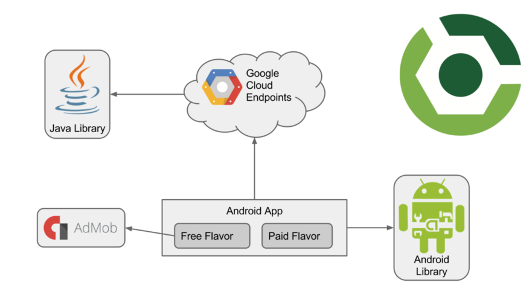
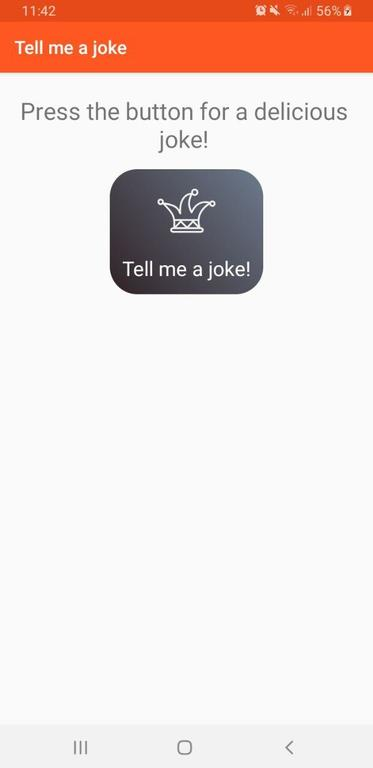

# Tell me a joke!

This app is part of the Udacity's Android Developer Nanodegree. The started code can be found [here](https://github.com/udacity/ud867/tree/master/FinalProject) 

## Application description

The application uses different modules (see below section) to present jokes to the user. It is also possible to share them.

There are two flavors:

* free Flavor: Shows adds at the bottom of MainActivity and when the "joke button" is pressed

* paid Flavour: No adds

## Application details

This android project contains the following modules:

* **funnyJoke**: Java library that provides jokes
* **funnyJokeAndroid**: Android library with an Activity that displays a joke received via intent
* **backend**: Google Cloud Endpoints (GCE) that uses the funnyJoke java library to obtain the jokes
* **app**: Contains the logic of the application. The jokes are obtained from the GCE (backend module) and displayed using the funnyJokeAndroid lbirary

The relationship between the modules can be seen in this diagram:

Image obtained from the Udacity's Android Developer Nanodegree

### Setup Google Cloud Endpoint

First of all you need to start the Google Cloud Endpoint (backend module) to retrieve the jokes. It is configured to be deployed locally, so some configuration needs to be done:

* In GetJokeAndLaunchJokeActivity.java [line 64](https://github.com/acasadoquijada/tell_me_a_joke/blob/master/app/src/main/java/com/udacity/gradle/builditbigger/GetJokeAndLaunchJokeActivity.java#L64)  you need to set the ip of your machine
* To use the free Flavor, you need set a valid application ID in its [Manifest file](https://github.com/acasadoquijada/tell_me_a_joke/blob/master/app/src/free/AndroidManifest.xml#L24) . More information about this [here](https://developers.google.com/admob/android/quick-start#update_your_androidmanifestxml) 

The next step is to deploy the GCE0

Open the Gradle tab in Android Studio and run the gradle task ***backend > appengineStart.***

To stop the GCE, use ***backend > appengineStop***

### Application flavors

As mentioned before the app has two flavors, free and paid.

The *source Flavor*, from where both inherit, doesn't contains adds. For this reason the paid Flavor uses this resources instead of creating specific ones. See [here](https://github.com/acasadoquijada/tell_me_a_joke/tree/master/app/src/paid) 

On the other hand, for the free one there are some specific resources that can be found [here](https://github.com/acasadoquijada/tell_me_a_joke/tree/master/app/src/free) 

To install the fee Flavour use the gradle task ***app > tasks > install > installFreeDebug***

To install the paid Flavour use ***app > tasks > install > installPaidDebug***

Please be aware that the tests related to ads may fail due to timing issues. if so, rerun the tests.

### Screenshots 

 

 

### External resources

The logos used in this applications are the following:

* **ic_joke.xml** Obtained from [flaticon](https://www.flaticon.com/)  and made by [Freepik](https://www.flaticon.com/authors/freepik) 

* **ic_jester.xml** Obtained from [flaticon](https://www.flaticon.com/)  and made by [Elias Bikbulatov](https://www.flaticon.com/authors/elias-bikbulatov") 

